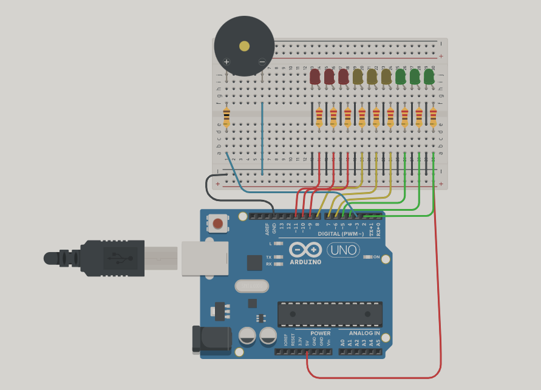
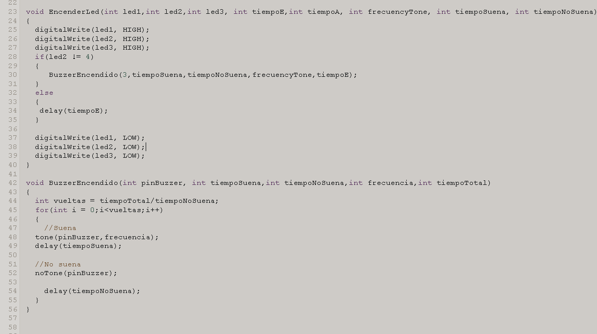

# Spd
<h1> Dojo 1 :  </h1>
 
<h2> Integrantes </h2>
<ul>
<li>Ingrid Natalia Ely</li>
<li>Vazquez Micaela</li>
<li>Aldana Olivera</li>
<li>Milagros Vanesa Bogliano</li>
<li>Manuel Bastos Gonzalez</li>
</ul>
<h2> Proyecto : Semáforo para no videntes</h2>
 
<h2> Descripción</h2>

El semáforo cuenta con 3 led de cada color y como tiene que tener señalización para personas no videntes, el buzzer sonará en distintos tiempos segun los leds que esten encendidos.

<h2> Función Principal</h2>
 

La funcion "EncenderLed" recibe: los tres leds, el tiempo que enciende el led el tiempo que se apaga, la frecuencia del Tono, el tiempo que deberia sonar y no sonar el buzzer.
Dentro de esta funcion se encienden los tres leds y llama a la funcion "BuzzerEncendido" que recibe el pin del Buzzer para pasarle a la funcion Tone y noTone. La funcion "BuzzerEncendido" divide el tiempo total que debe quedar encendidos los leds con el tiempo que no debe sonar el buzzer, y el valor de esa division me da la cantidad de vueltas.

<h2> Link al proyecto</h2>
https://www.tinkercad.com/things/kVGsLRHheSs-dojo1/editel?sharecode=L6UKvwPLMAkwNNJXLWdEm8D8b6wGFzsnyoKWmPJqlmU
