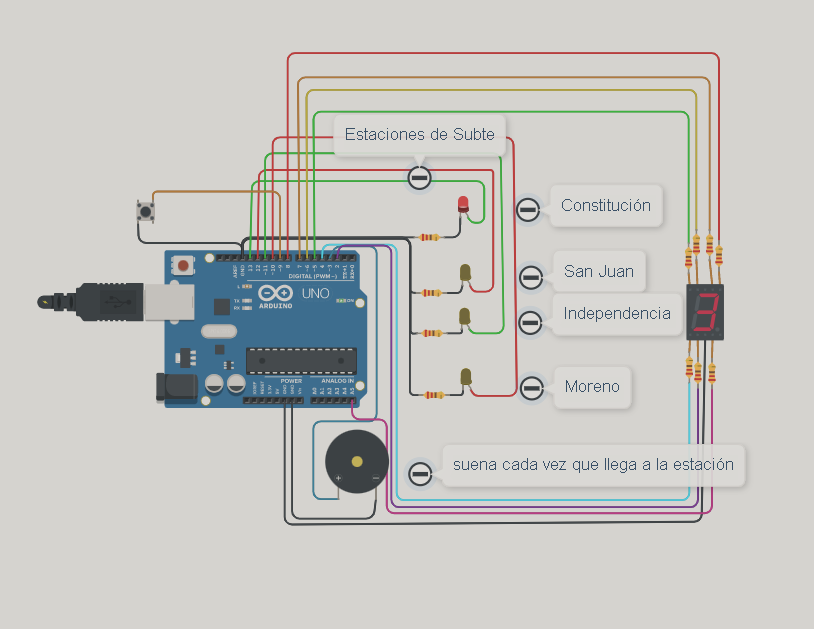
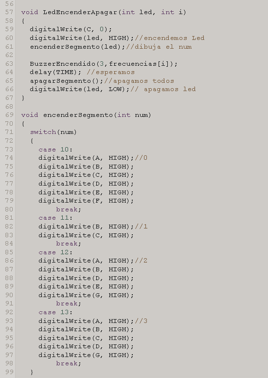
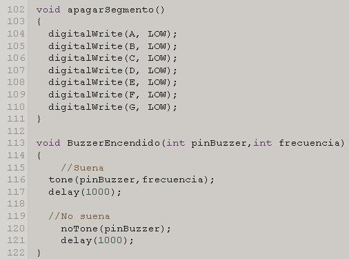

# Spd 
<h1> Dojo 2   </h1>
<h2> Integrantes </h2>
<ul>
<li>Ingrid Natalia Ely</li>
<li>Vazquez Micaela</li>
<li>Aldana Olivera</li>
<li>Milagros Vanesa Bogliano</li>
<li>Manuel Bastos Gonzalez</li>
</ul>
<h2> Proyecto : Estación de subte</h2>
 
<h2> Descripción</h2>

La simulación comienza al tocar el botón una vez. Cada led representá una estación y en el 7 Segmentos se muestra la cantidad de estaciones que faltán para llegar a la estacion Moreno (ultimo led), y cada vez que se enciende un led suena una vez el buzzer simulando así la llegada a la distintas estaciones.

<h2> Funciones</h2>
 
 
<ul>
<li>LedEncenderApagar(función principal)</li>
  
Esta función principal se encuentra dentro de dos for que están dentro del loop. Recibe el número del led y la posición en la que se está iterando. Dentro de la función se enciende el led, se llama a la función “encenderSegmento” que recibe el número del led para encender los segmentos correspondientes. Luego utiliza “BuzzerEncendido” que recibe el pin y la frecuencia para sonar cada vez que se encienda un led. Después se apagan todos los segmentos con la función “apagarSegmento” y se apaga el led. 

<li>encenderSegmento</li>
  
Recibe el número del led por parámetro , se lo pasa al switch y según el número se va a ejecutar el case que encenderá los segmentos correspondientes.

<li>apagarSegmento</li>
  
Apaga todos los segmentos.

<li>BuzzerEncendido</li>
  
Recibe el pin del Buzzer y el número de la frecuencia y se lo pasa a la función Tone y noTone.

</ul>
<h2> Link al proyecto</h2>

https://www.tinkercad.com/things/f745EOw9kos-dojo-2/editel?sharecode=tU5LuJSTOX6YFpeb7OT8jqkdg52voF0WcZ2nupE6ZcM

